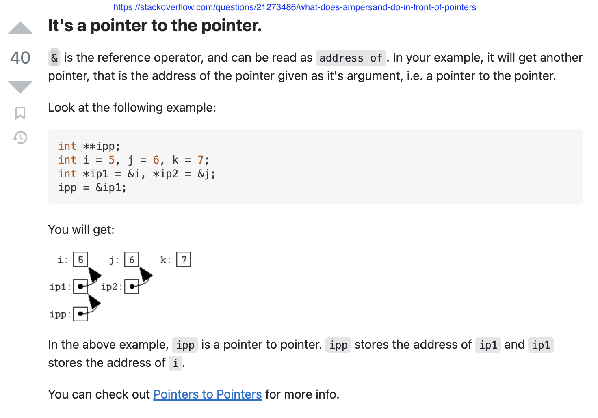

# Advanced C++ Playground

Small self-contained programs written to try out a specific C++ mechanism,
rather than to solve a problem. Each one compiles and runs on its own.

## Programs

### `cpp_logger.cpp`

A stream-style logger built from a templated `operator<<`. The interesting part
is `if constexpr (std::is_same<T, int>::value)`, which picks the `int` branch at
compile time instead of at run time, so the discarded branch never has to be
valid for the other type. `log()` is a `friend` that sets the level and returns
the logger by reference, which is what lets the calls chain:

```cpp
log(l, Logger::Level::info) << "Hello world!";
```

### `bubble_sort_list.cpp`

Bubble sort over a `std::list`, which has no random access, so the swap has to
go through iterators: `std::next` to walk to a position, `std::distance` for the
loop bound, and `std::iter_swap` to exchange two elements without touching the
nodes. Sorting a `std::list` this way is deliberately the hard road; `list::sort`
exists and does a merge sort.

### `vetor_custom_bounds.cpp`

A `Vetor<T>` whose valid index range is an arbitrary `[inicio, fim]` rather than
`[0, n)`. Both `operator[]` overloads translate the caller's index into the
backing array and throw `std::out_of_range` outside the bounds, and
`Redimensionar` copies across only the overlap between the old and new ranges.
Storage is a raw `new[]` / `delete[]` pair. Originally VPL exercise 18.

Reads commands on stdin: `a <i> <value>` assigns, `v <i>` prints one,
`r <inicio> <fim>` resizes, `s` prints the contents, anything else quits.
(`s` loops `i < fim`, so it stops one short of the last index.)

```shell
printf '1 3\na 1 alpha\na 2 beta\nv 2\ns\nq\n' | make run P=vetor_custom_bounds
```

## Building

```shell
make all                  # compile everything
make cpp_logger           # compile one
make run P=cpp_logger     # compile and run it
make run P=x IN=file      # ...feeding a file to stdin
make list
make clean
```

Binaries land in `build/`, which is git-ignored. Default standard is C++17
(`bubble_sort_list` needs C++14 or later for `auto` return type deduction);
override with `make STD=c++20` or point `CXX` at another compiler.

For quick throwaway experiments without a checkout:
[onlinegdb](https://www.onlinegdb.com/online_c++_compiler).

## Pointers and references


